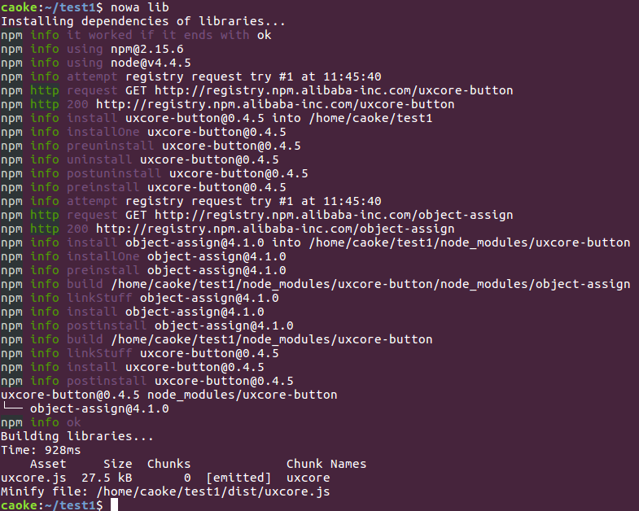

# 组件库的定制构建

---

## 使用

可以通过 `nowa lib` 命令来完成组件库的定制构建。

> 如果提示找不到 lib 命令，请通过 `nowa install lib` 来安装

```shell
nowa lib
```

该命令必须使用在通过 `nowa init` 创建的项目中，请在项目根目录下执行。


// TODO

`nowa build` 主要做了以下几个事情：
- 拷贝 html 文件和第三方依赖库到输出目录
- 对源代码做 webpack 构建（针对所有环境变量组合分别输出，详见[环境变量篇](huan_jing_bian_liang.md)）
- 对所有输出文件做压缩和代码优化

## 参数

`nowa build` 接受以下候选参数：

- `-s, --src <dir>` 源代码目录，默认指向 `src`
- `-d, --dist <dir>` 输出代码目录，默认指向 `dist`
- `-e  --entry <file>` 应用入口文件，默认指向 `app/app.js`
- `    --pages` 开启多页面入口规则
- `    --vars` 运行时环境变量（详见[环境变量篇](huan_jing_bian_liang.md)）
- `    --buildvars` 构建时环境变量（详见[环境变量篇](huan_jing_bian_liang.md)）
- `    --externals` webpack 外部变量定义
- `-o, --loose` 使用 babel es2015 的宽松模式来做代码转换
- `-c, --keepconsole` 保留源代码中的 `console.log`，默认会删除
- `    --skipminify` 跳过压缩任务，默认会进行代码压缩
- `-p, --progress` 在等待时显示 webpack 的构建进度